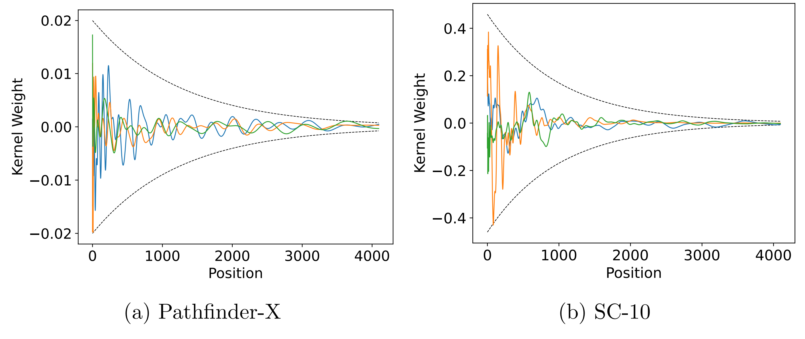

# [What Makes Convolutional Models Great on Long Sequence Modeling?](https://arxiv.org/abs/2210.09298)

*Yuhong Li\*, Tianle Cai\*, Yi Zhang, Deming Chen, Debadeepta Dey*

## Update log

- 10/17/2022: Core code released.
- Upcoming: Full code release.

## Overview

Convolutional models have been widely used in multiple domains. However, most existing models only use local convolution, making the model unable to handle long-range dependency efficiently. Attention overcomes this problem by aggregating global information but also makes the computational complexity quadratic to the sequence length. 

Recently, Gu et al. [2021] proposed a model called S4 inspired by the state space model. S4 can be efficiently implemented as a global convolutional model whose kernel size equals the input sequence length. S4 can model much longer sequences than Transformers and achieve significant gains over SoTA on several long-range tasks. Despite its empirical success, S4 is involved. It requires sophisticated parameterization and initialization schemes. As a result, S4 is less intuitive and hard to use. 

Here we aim to demystify S4 and extract basic principles that contribute to the success of S4 as a global convolutional model. We focus on the structure of the convolution kernel and identify two critical but intuitive principles enjoyed by S4 that are sufficient to make up an effective global convolutional model: 

1. The parameterization of the convolutional kernel needs to be efficient in the sense that the number of parameters should scale sub-linearly with sequence length. 
2. The kernel needs to satisfy a decaying structure that the weights for convolving with closer neighbors are larger than the more distant ones. 

Based on the two principles, we propose a simple yet effective convolutional model called Structured Global Convolution (SGConv). 


SGConv exhibits strong empirical performance over several tasks: 
1. With faster speed, SGConv surpasses S4 on Long Range Arena and Speech Command datasets. 
2. When plugging SGConv into standard language and vision models, it shows the potential to improve both efficiency and performance.


## Code

Based on the amazing [codebase](https://github.com/HazyResearch/state-spaces) by HazyResearch.

## Citation

```
@misc{li2022makes,
      title={What Makes Convolutional Models Great on Long Sequence Modeling?}, 
      author={Yuhong Li and Tianle Cai and Yi Zhang and Deming Chen and Debadeepta Dey},
      year={2022},
      eprint={2210.09298},
      archivePrefix={arXiv},
      primaryClass={cs.LG}
}
```